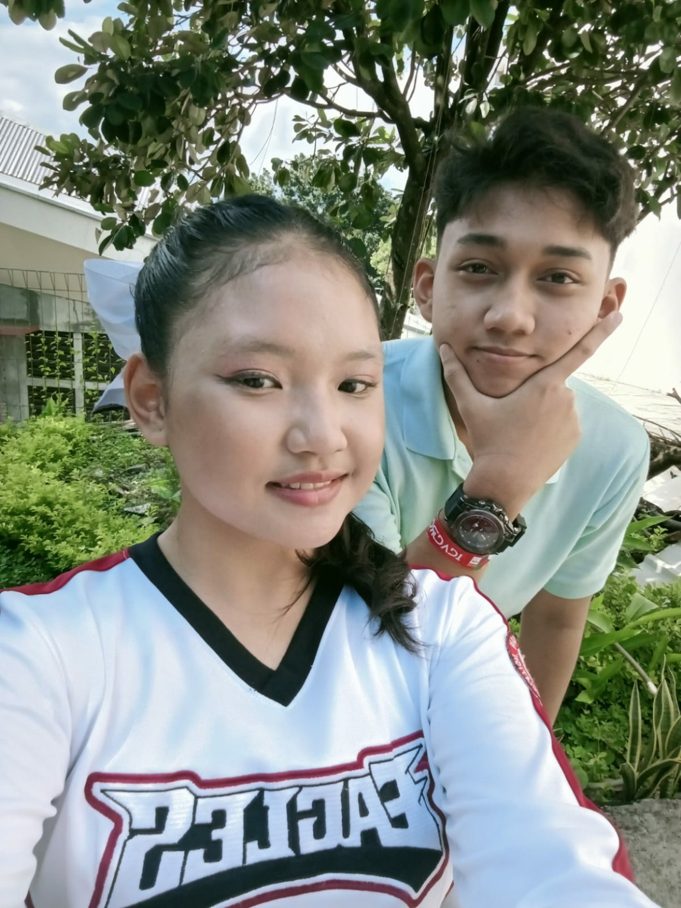

# hbdsitacamelia
<html lang="id">
<head>
  <meta charset="UTF-8" />
  <meta name="viewport" content="width=device-width, initial-scale=1.0" />
  <title>Selamat Ulang Tahun Sita</title>

}
    body {
      margin: 0;
      font-family: 'Segoe UI', sans-serif;
      background: linear-gradient(135deg, #d0e8ff, #f5e1ff, #fff0f5);
      color: #333;
      overflow-x: hidden;
    }
    header {
      background-color: #4682B4;
      color: white;
      padding: 20px;
      text-align: center;
    }
    .container {
      padding: 20px;
      max-width: 800px;
      margin: auto;
    }
    .love {
      color: #ff69b4;
    }
    .gallery {
  display: grid;
  grid-template-columns: repeat(auto-fill, minmax(120px, 1fr));
  gap: 12px;
  margin-top: 20px;
}

.gallery img {
  width: 100%;
  aspect-ratio: 1 / 1;
  object-fit: cover;
  border-radius: 12px;
  box-shadow: 0 3px 10px rgba(0, 0, 0, 0.15);
}
    footer {
      text-align: center;
      padding: 20px;
      font-size: 0.9em;
      color: #555;
    }
    @keyframes fall {
      to {
        transform: translateY(100vh) rotate(360deg);
        opacity: 0;
      }
    }
    .heart {
      position: fixed;
      top: -50px;
      font-size: 24px;
      color: pink;
      animation: fall linear infinite;
    }
  </style>
</head>
<body>
  <header>
    <!-- Tombol Musik --> 
    <button onclick="document.getElementById('bgm').play()" style="
  position: fixed;
  top: 10px;
  right: 10px;
  padding: 10px 15px;
  background: #ff69b4;
  color: white;
  border: none;
  border-radius: 10px;
  box-shadow: 0 2px 6px rgba(0,0,0,0.2);
  font-size: 16px;
  z-index: 9999;
">🎵 Putar Musik</button>

<!-- Pemutar Musik -->
<audio id="bgm" loop>
  <source src="Nadhif_Basalamah_-_bergema_sampai_selamanya__Official_Lyric_Video_(128k).mp3" type="audio/mpeg" />
  Browser kamu tidak mendukung audio.
</audio>
    <h1>Selamat Ulang Tahun ke-18 Sita Camelia Azzahra 🎉</h1>
  </header>
  

    

      Di usia baru ini, aku ingin mengucapkan selamat ulang tahun yang paling tulus untukmu.  
      Semoga segala doamu dikabulkan oleh Allah, terutama harapanmu untuk masuk ke universitas impianmu. 
      Di usia 18 ini, semoga kamu menjadi pribadi yang lebih dewasa, kuat, dan penuh semangat dalam menggapai cita-cita.
      Jangan takut bermimpi besar, karena kamu layak mendapatkan yang terbaik.  
      Dari aku yang selalu mendoakanmu dengan tulus, 
      <strong>Van Danu</strong>
    

    <h2 style="text-align:center;">📸 Kenangan Manis Kita</h2>
    

      
      
      
      
      
      
      
    

  

  <footer>
    Dibuat dengan &#10084; oleh Van Danu untuk Sita - 30 Juni 2025
  </footer>

  <audio autoplay loop hidden>
    <source src="https://cdn.pixabay.com/download/audio/2022/03/15/audio_3db4cc90d7.mp3?filename=romantic-melody-11743.mp3" type="audio/mpeg">
    Browser kamu tidak mendukung pemutar musik.
  </audio>

  

</body>
</html>
